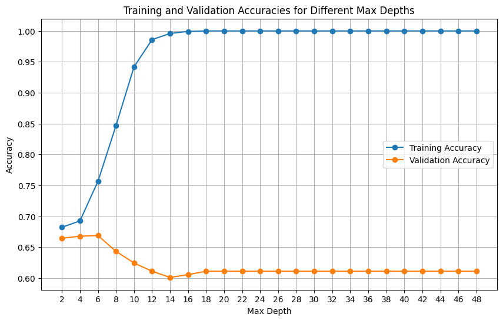
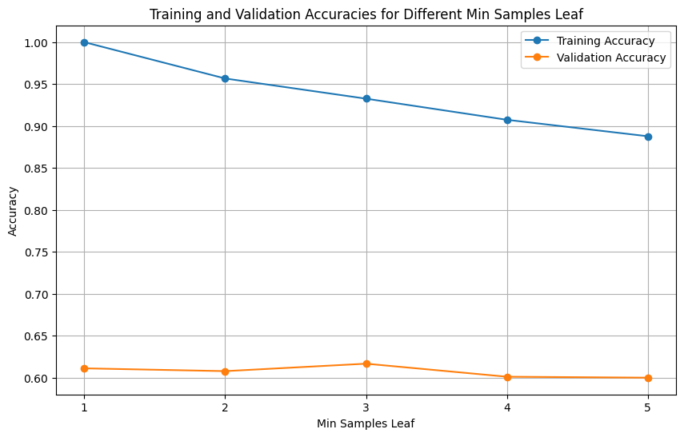
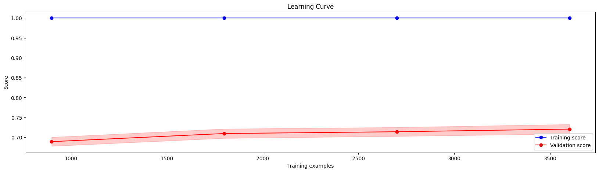
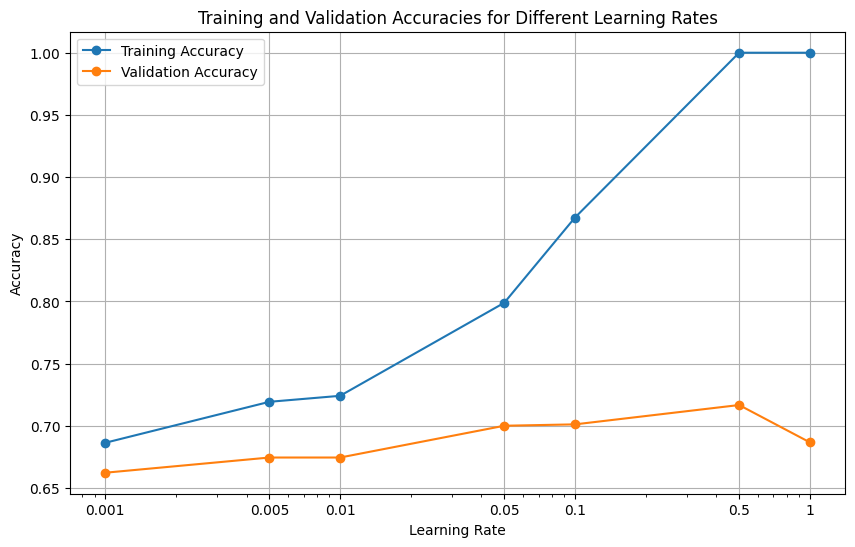
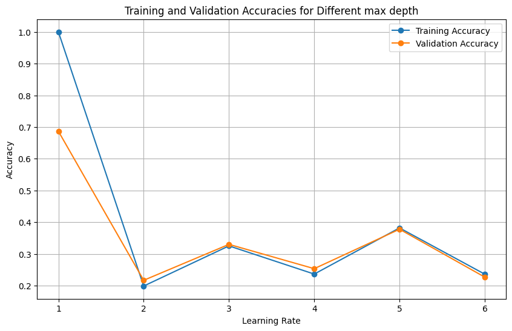
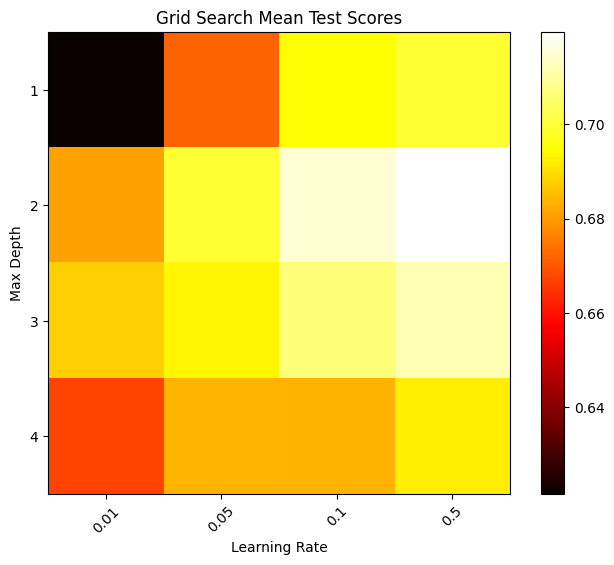

# Practice Number 1 - README

[](https://colab.research.google.com/drive/1uR806lqfcw2c1COt5zGLLJ2o6E6umLXy?usp=sharing)
[](https://www.python.org/downloads/)
[](https://github.com/username/repository/blob/main/requirements.txt)


## Introduction
In this practice, we explore two fundamental machine learning algorithms: 
- **Decision Trees**
- **K-Nearest Neighbors (KNN)**

We implement these algorithms, evaluate their performance, and explore techniques for hyperparameter tuning to improve model accuracy.

## Table of Contents
***Decsions Tree***
- [Decision Trees Implementation](#section-a-implementation-of-decision-trees)
- [Model Evaluation and Hyperparameter Tuning](#section-b-model-evaluation-and-hyperparameter-tuning)
- [Random Forest Implementation and Evaluation](#section-c-random-forest-implementation-and-evaluation)
- [Gradient Boosting Implementation and Evaluation](#section-d-gradient-boosting-implementation-and-evaluation)


***K-Nearest Neighbors (KNN)***
- [Data Preprocessing](#data-preprocessing)
  - [Handling Categorical Variables](#handling-categorical-variables)
  - [Binary Encoding and Numerical Standardization](#binary-encoding-and-numerical-standardization)
  - [Splitting the Dataset](#splitting-the-dataset)
- [KNN Model Implementation](#knn-model-implementation)
  - [Euclidean Distance Calculation](#euclidean-distance-calculation)
  - [Model Fitting and Prediction](#model-fitting-and-prediction)
- [Hyperparameter Tuning](#hyperparameter-tuning)
- [ROC Curve and Model Evaluation](#roc-curve-and-model-evaluation)
  - [Probability Prediction](#probability-prediction)
  - [ROC Curve Generation](#roc-curve-generation)
- [Conclusion](#conclusion)


# Decision Trees and Random Forest Classifier
Decision Trees Practice

This repository contains code for implementing and evaluating Decision Trees for multi-class classification tasks. The practice is divided into several sections:

### Section A: Implementation of Decision Trees
In this section, we implement a complete Decision Tree classifier from scratch using Python and NumPy. The implementation includes the following components:

- Node Class: Defines the structure of a node in the decision tree.
- DecisionTree Class: Represents the Decision Tree model with methods for fitting and predicting.
- Helper Functions: Includes functions for calculating entropy, information gain, finding the best split, and building the decision tree recursively.

```python
class node:
  def __init__(self ,parent, left, right , values , column, threshhold):
    self.parent:node = parent
    self.left:node  = left
    self.right:node = right
    self.values:np.ndarray = values
    self.column:int = column
    self.threshhold:float = threshhold

  def is_leaf(self):
    if self.values is None:
      return False
    return True
```

```python
class DecisionTree:
    def __init__(self, min_samples_split=2, max_depth=5, n_features=None ):
        """
        Initialize the Decision Tree model.
        """
        self.n_features = n_features
        self.max_depth=max_depth
        self.min_samples_split=min_samples_split
        self.tree = node(None, None, None, None, None, None)
        self.number_of_classes = -1
        self.classes = None
```
### Section B: Model Evaluation and Hyperparameter Tuning

- ***Model Training and Evaluation:*** We trained several Decision Tree classifiers using different hyperparameters and evaluated their performance on a given dataset. The hyperparameters explored include:
- - Split criterion (Gini impurity or Entropy)
- - Maximum depth of the tree
- - Minimum samples required to split a node
- - Minimum samples required to be at a leaf node
We used the DecisionTreeClassifier from scikit-learn to create and train the models, and then measured their accuracy on the training data.

- ***Hyperparameter Tuning:***
 To find the optimal hyperparameters, we performed a grid search over a range of values for max_depth and min_samples_leaf, using a validation set. We visualized the learning curves to understand the model's performance as the training set size increases.




### Section C: Random Forest Implementation and Evaluation
In this section, we implemented a Random Forest classifier using scikit-learn's RandomForestClassifier. We trained the Random Forest with 100 trees and evaluated its performance on a validation set.
We used different sets of training set sizes using `learning_curve` 

```python
train_sizes, train_scores, val_scores = learning_curve(model, X_data, Y_data, cv=5  , scoring='accuracy', train_sizes=[0.25, 0.5, 0.75, 1])
```




### Section D: Gradient Boosting Implementation and Evaluation
We implemented a Gradient Boosting classifier using scikit-learn's GradientBoostingClassifier. We tuned hyperparameters such as max_depth and learning_rate using GridSearchCV to find the best combination for our model. We evaluated the final model's performance on a test set and visualized the results using a confusion matrix.






## Data Preprocessing
### Handling Categorical Variables
We transform categorical data into one-hot encoding using the `pd.get_dummies` function.

### Binary Encoding and Numerical Standardization
Binary encoding is applied to "Yes/No" columns, and numerical standardization is performed on the age column using `LabelEncoder` and `StandardScaler`.

### Splitting the Dataset
The dataset is split into training, validation, and test sets using `train_test_split` from scikit-learn.
```python
X_train, X_rest, y_train, y_rest = train_test_split(X, y, test_size=0.4, random_state=42)
X_val, X_test, y_val, y_test = train_test_split(X_rest, y_rest, test_size=0.5, random_state=42)
```
```
X_train.shape: (209, 125)
X_val.shape: (70, 125)
X_test.shape:  (70, 125)
y_train.shape: (209,)
y_test.shape:  (70,)
y_val.shape:  (70,)
```
## KNN Model Implementation
### Euclidean Distance Calculation
A function `euclidean_dist` is defined to calculate the Euclidean distance between two data points.
```python
def euclidean_dist(x1, x2):
    return np.sqrt(np.sum((x1 - x2) ** 2))
```
### Model Fitting and Prediction
The `KNN` class is implemented with methods for fitting and predicting. The `fit` method initializes the model with training data, while the `predict` method predicts the class labels for new data points based on the K nearest neighbors.
```python
class KNN:
    def __init__(self, k=3):
        self.k = k
        self.X_train = None
        self.y_train = None

    def fit(self, X_train, y_train):
        self.X_train = X_train
        self.y_train = y_train

    def predict(self, X):
        predictions = [self.single_predict(x) for x in X]
        return np.array(predictions)

    def single_predict(self, x):
        distances = [self.euclidean_dist(x, x_train) for x_train in self.X_train]
        k_near_neighbors_indices = np.argsort(distances)[:self.k]
        k_near_neighbor_labels = [self.y_train[i] for i in k_near_neighbors_indices]
        vote = np.bincount(k_near_neighbor_labels).argmax()
        return vote

    def euclidean_dist(self, x1, x2):
        return np.sqrt(np.sum((x1 - x2) ** 2))
```
## Hyperparameter Tuning
The hyperparameter K is tuned by testing values from 1 to 20 and selecting the one with the highest accuracy on the validation set.

## ROC Curve and Model Evaluation
### Probability Prediction
A modified version of the `predict` method called `single_predict_proba` is implemented to generate probabilities for ROC curve plotting.

### ROC Curve Generation
The ROC curve and the area under the curve (AUC) are computed for each K value using `roc_curve` and `auc` functions from scikit-learn.

## Conclusion
The KNN model with K=1 demonstrates the highest AUC on the validation set, indicating its superior performance in this classification task. However, the choice of K may vary depending on the specific requirements and characteristics of the dataset.
