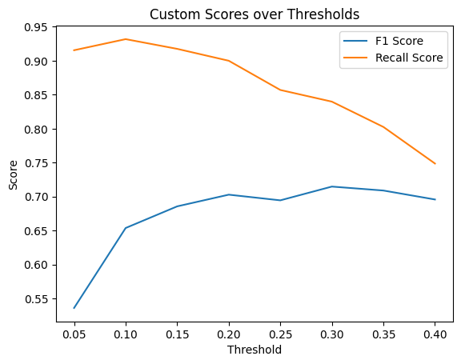

# README - Practice Number 2: Stroke Prediction and Insurance Cost Prediction

[](https://colab.research.google.com/drive/19gz7e82r64mSo6nlEzNGXp4zhjXDt45W?usp=sharing)
[](https://www.python.org/downloads/)
[](https://github.com/your_username/repository/blob/main/requirements.txt)

## Introduction

Welcome to Practice Number 2! In this practice, we explore two important machine learning tasks:

- **Stroke Prediction**
- **Insurance Cost Prediction**

We delve into preprocessing steps, model building, and evaluation techniques to achieve accurate predictions.

## Table of Contents

***Stroke Prediction***
- [Data Preprocessing](#data-preprocessing)
  - [Data Loading and Cleaning](#data-loading-and-cleaning)
  - [Handling Missing Values](#handling-missing-values)
  - [Encoding Categorical Variables](#encoding-categorical-variables)
  - [Train-Test Split](#train-test-split)
- [Model Building](#model-building)
  - [Support Vector Classifier (SVC)](#support-vector-classifier-svc)
  - [Results and Analysis](#results-and-analysis)

***Insurance Cost Prediction***
- [Data Preprocessing](#data-preprocessing-1)
  - [Data Loading and Exploration](#data-loading-and-exploration)
  - [Handling Missing Values](#handling-missing-values-1)
  - [Feature Scaling](#feature-scaling)
  - [Train-Test Split](#train-test-split-1)
- [Model Building](#model-building-1)
  - [Linear Regression](#linear-regression)
  - [Polynomial Regression](#polynomial-regression)
  - [Results and Analysis](#results-and-analysis-1)

# Stroke Prediction

## Data Preprocessing

### Data Loading and Cleaning

- The dataset containing information about individuals and their stroke history is loaded.
- Irrelevant features such as 'id' are dropped from the dataset.

### Handling Missing Values
```python
missing_values_per_feature = data.isnull().sum()

if missing_values_per_feature.any():
    print('Features with missing values:')
    print(missing_values_per_feature[missing_values_per_feature > 0])
else:
    print('No missing values in any feature.')
```
```
Features with missing values:
bmi                1462
smoking_status    13292
dtype: int64
```

- Missing values in numerical features are imputed using the mean.
```python
from sklearn.impute import SimpleImputer

numericals = ['age', 'avg_glucose_level', 'bmi', 'hypertension', 'heart_disease']
numeric_imputer = SimpleImputer(strategy='mean')
X[numericals] = numeric_imputer.fit_transform(X[numericals])
scaler = StandardScaler()
X[numericals] = scaler.fit_transform(X[numericals])
```
- Categorical features are imputed using the most frequent value.
```python
categoricals = ['gender', 'work_type', 'Residence_type', 'smoking_status']
categorical_imputer = SimpleImputer(strategy='most_frequent')
X[categoricals] = categorical_imputer.fit_transform(X[categoricals])
```
### Encoding Categorical Variables

- Categorical variables are one-hot encoded for model training.

### Train-Test Split

- The dataset is split into training and testing sets for model evaluation.

## Model Building

### Support Vector Classifier (SVC)

- A linear SVC model is trained on the preprocessed data.
- Model performance is evaluated using accuracy, confusion matrix, and classification report metrics.

### Results and Analysis

- Despite preprocessing efforts, the initial SVC model performs poorly.
```
Accuracy: 0.7302995391705069
Confusion Matrix:
 [[6211 2312]
 [  29  128]]
Classification Report:
               precision    recall  f1-score   support

           0       1.00      0.73      0.84      8523
           1       0.05      0.82      0.10       157

    accuracy                           0.73      8680
   macro avg       0.52      0.77      0.47      8680
weighted avg       0.98      0.73      0.83      8680
```

if you look at the report, our f1-score for ones is only 0.1 and it is really bad for detecting strokes!
- Further investigation reveals issues with data quality and class imbalance.
```
majority_zero.shape: (42617, 12)
minority_one.shape: (783, 12)
```

- A new balanced dataset is created by undersampling the majority class, leading to improved model performance.
```
Accuracy: 0.7680851063829788
Confusion Matrix:
 [[227  86]
 [ 23 134]]
Classification Report:
               precision    recall  f1-score   support

           0       0.91      0.73      0.81       313
           1       0.61      0.85      0.71       157

    accuracy                           0.77       470
   macro avg       0.76      0.79      0.76       470
weighted avg       0.81      0.77      0.77       470
```
Wow! 🙂

Much better. Now we have 0.85 of recall for ones.

- Custom threshold adjustment techniques are applied to enhance model performance further.

```python
model_poly = SVC(kernel='linear', class_weight='balanced', probability=True, random_state=42)
model_poly.fit(X_train, y_train)
y_pred_poly_proba = model_poly.predict_proba(X_test)[:, 1]

custom_threshold = 0.3
y_pred_poly_thresholded = (y_pred_poly_proba > custom_threshold).astype(int)

classification_rep_poly_thresholded = classification_report(y_test, y_pred_poly_thresholded)
print('Classification Report (3rd-degree Poly SVC with Threshold Adjustment):\n', classification_rep_poly_thresholded)
```

but which threshold is the best one? let's find it using our new function custom_scorer!

As we are detecting stroke, it is very important not to miss the ones, so I have set 90% of our attention to F1 score of ones in my custom function.


```python
def custom_scorer(y_true, y_pred):
    f1_ones = f1_score(y_true, y_pred, pos_label=1)
    f1_zeros = f1_score(y_true, y_pred, pos_label=0)
    recall_ones = recall_score(y_true, y_pred, pos_label=1)
    recall_zeros = recall_score(y_true, y_pred, pos_label=0)

    return 0.9 * f1_ones + 0.1 * f1_zeros, 0.9 * recall_ones + 0.1 * recall_zeros

model_poly = SVC(kernel='linear', class_weight='balanced', probability=True, random_state=42)
model_poly.fit(X_train, y_train)

custom_thresholds = [0.05, 0.1, 0.15, 0.20, 0.25, 0.30, 0.35, 0.4]
best_threshold = custom_thresholds[0]
best_score_f1, best_score_recall = 0, 0

history_scores_f1 = []
history_scores_recall = []

for threshold in custom_thresholds:
    y_pred_poly_proba = model_poly.predict_proba(X_test)[:, 1]
    pred = (y_pred_poly_proba > threshold).astype(int)
    score_f1, score_recall = custom_scorer(y_test, pred)
    history_scores_f1.append(score_f1)
    history_scores_recall.append(score_recall)

    if score_f1 > best_score_f1:
        best_threshold = threshold
        best_score_f1 = score_f1
        best_score_recall = score_recall
        best_pred = pred

```



```
Best F1 Score: 0.7147368421052631
Best Recall Score: 0.839718361449706
Best Threshold: 0.3
Classification Report for Best Threshold:
              precision    recall  f1-score   support

           0       0.91      0.72      0.80       313
           1       0.60      0.85      0.71       157

    accuracy                           0.76       470
   macro avg       0.75      0.78      0.75       470
weighted avg       0.80      0.76      0.77       470
``` 
# Insurance Cost Prediction

## Data Preprocessing

### Data Loading and Exploration

- The insurance dataset is loaded and explored to understand its structure.

### Handling Missing Values

- Missing values are handled, and categorical variables are one-hot encoded.

### Feature Scaling

- Numerical features are scaled using standard scaling to ensure uniformity.

### Train-Test Split

- The dataset is split into training and testing sets for model training.

## Model Building

### Linear Regression

- A simple linear regression model is built to predict insurance costs.

### Polynomial Regression

- Polynomial features are added to capture non-linear relationships, improving model performance.

### Results and Analysis

- The linear regression model provides decent accuracy in predicting insurance costs.
- Polynomial regression outperforms the linear model, even with fewer training epochs.
- Model predictions are visualized against actual insurance costs, demonstrating their effectiveness.

## Conclusion

In conclusion, this practice showcases the application of machine learning techniques in predicting strokes and insurance costs. Through data preprocessing, model training, and evaluation, we achieve meaningful insights and predictive accuracy in both tasks, highlighting the importance of careful data handling and model selection.

