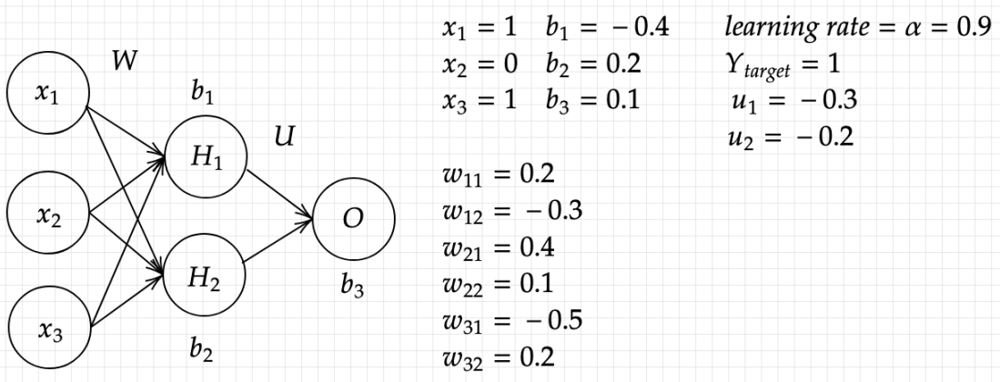

# README - Practice Number 3: Simple Neural Network Implementation and Training

[](https://colab.research.google.com/drive/1uw2xl7NoCt-AXFrcmO6bnhV8DhMtW49w?usp=sharing)


## Table of Contents
- [Introduction](#introduction)
- [Implementation Details](#implementation-details)
  - [Sigmoid Activation Function](#sigmoid-activation-function)
  - [Neural Network Parameters](#neural-network-parameters)
  - [Training Parameters](#training-parameters)
- [Training the Neural Network](#training-the-neural-network)
- [Conclusion](#conclusion)

## Introduction

Welcome to Practice Number 3! In this practice, we will implement a simple neural network with a hidden layer and train it using the backpropagation algorithm. The neural network will use sigmoid activation functions and the error squared criterion function as the cost. We'll update the weights using the reduction plus momentum method.



## Implementation Details

We'll implement the neural network in Python using NumPy for numerical computations. The network will consist of an input layer, a hidden layer, and an output layer.

### Sigmoid Activation Function

We define a sigmoid activation function and its derivative:

```python
import numpy as np

def sigmoid(x):
    return 1 / (1 + np.exp(-x))

def sigmoid_derivative(x):
    return sigmoid(x) * (1 - sigmoid(x))

```

### Training Parameters
We set the learning rate, momentum factor, and number of epochs:
```python
alpha = 0.9
beta = 0.8
epochs = 1000
```

## Training the Neural Network

We train the neural network for a specified number of epochs using backpropagation. The training process involves forward propagation to compute the output and loss, followed by backward propagation to update the weights and biases.
```python
for epoch in range(epochs):
    # Forward propagation
    ...

    # Backward propagation
    ...

    # Update weights and biases with momentum
    ...

    # Print progress
    ...

# Print final weights, biases, and loss
...

# Print final prediction
...
```

## Conclusion
In this practice, we implemented a simple neural network from scratch and trained it using the backpropagation algorithm. We updated the weights using the reduction plus momentum method and monitored the training progress. This exercise provides valuable insight into the inner workings of neural networks and their training process.
