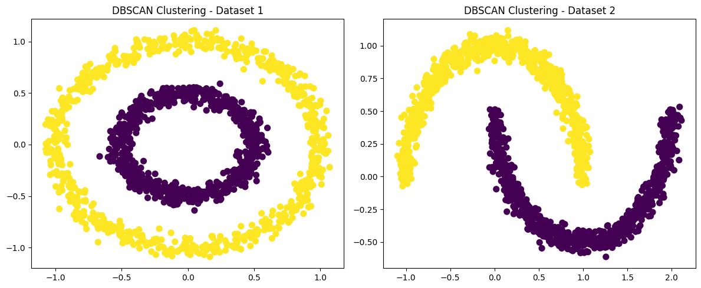

# Practice 4: Implementing DBSCAN Algorithm and Clustering

[](https://colab.research.google.com/drive/1khfC6_ZHTRYTqvwQHdgDw1VlAWJmHGCY?usp=sharing)


## Table of Contents
- [Introduction](#introduction)
- [Algorithm Overview](#algorithm-overview)
- [Implementation](#implementation)
- [Visualization](#visualization)
- [Results](#results)
- [Conclusion](#conclusion)

## Introduction

In this practice, we will implement the DBSCAN algorithm and use it to cluster two provided datasets. First, we will draw their scatter diagrams, then apply the implemented algorithm to detect clusters and visualize them with different colors.


## Algorithm Overview

DBSCAN (Density-Based Spatial Clustering of Applications with Noise) is a clustering algorithm designed to identify clusters in a dataset based on the density of data points in the feature space. Unlike some other clustering algorithms, DBSCAN doesn't require the number of clusters to be specified beforehand and can discover clusters of arbitrary shapes. The algorithm categorizes data points into three types: Core Point, Border Point, and Noise Point (Outlier).

## Implementation

We will implement the DBSCAN algorithm using the `sklearn.cluster.DBSCAN` class. The key hyperparameters of DBSCAN are:
- Epsilon (ε): It defines the radius within which the algorithm searches for other data points to form a cluster.
- MinPoints: It specifies the minimum number of data points required to form a dense region (cluster).


```python
epsilons = [0.2, 0.5, 1.0]
min_samples_values = [3, 5, 8]

plt.scatter(df1['x'], df1['y'], marker='o', s=50)
plt.title('Original Dataset')
plt.show()

rows = len(epsilons)
cols = len(min_samples_values)
fig, axes = plt.subplots(rows, cols, figsize=(12, 8))

for i, epsilon in enumerate(epsilons):
    for j, min_samples in enumerate(min_samples_values):
        dbscan = DBSCAN(eps=epsilon, min_samples=min_samples)
        clusters = dbscan.fit_predict(df1[['x', 'y']])

        ax = axes[i, j] if rows > 1 else axes[j]
        scatter = ax.scatter(df1['x'], df1['y'], c=clusters, cmap='viridis', marker='o', s=50)
        ax.set_title(f'Eps: {epsilon}, Min Samples: {min_samples}')

plt.tight_layout()
plt.show()
```

## Visualization

We will visualize the original datasets and the detected clusters using scatter plots. Different hyperparameter combinations will be explored to determine the best parameters for clustering each dataset.


## Results

- Dataset 1:
    - Best hyperparameters: Epsilon = 0.2, Min Samples = 5
    - Clustering visualization: Scatter plot with detected clusters.

- Dataset 2:
    - Best hyperparameters: Epsilon = 0.2, Min Samples = 5
    - Clustering visualization: Scatter plot with detected clusters.




## Conclusion

In this practice, we implemented the DBSCAN algorithm and applied it to cluster two datasets. By exploring different hyperparameter combinations, we identified the optimal parameters for each dataset and visualized the clustering results.

This exercise provides practical experience in implementing and using a density-based clustering algorithm for real-world datasets.

That concludes the practice! 😊✌️
