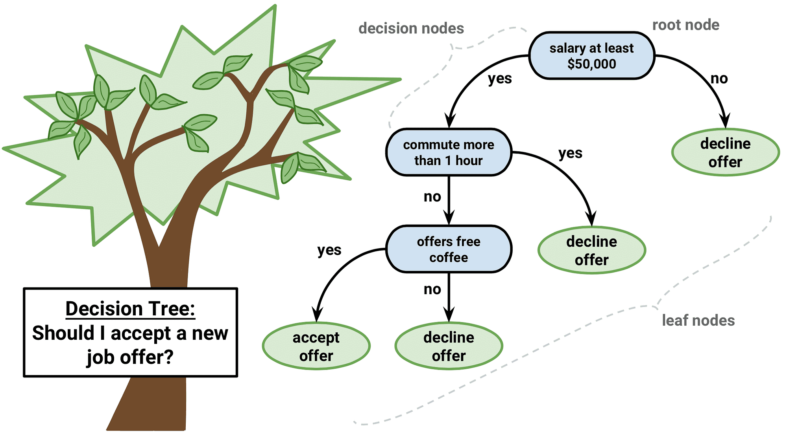
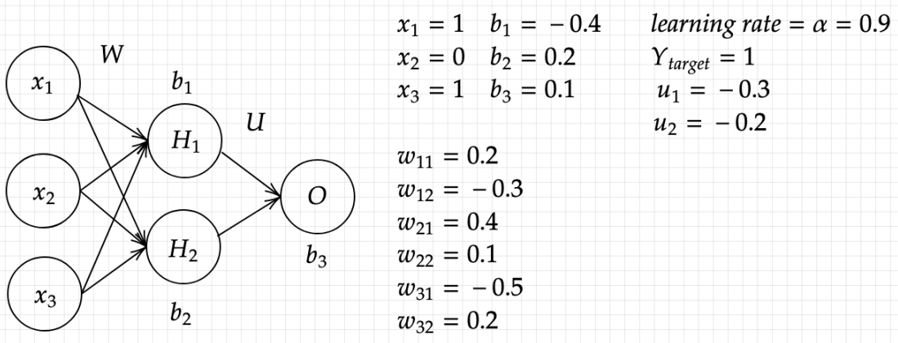
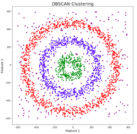

# Machine Learning Practices

Welcome to the machine learning practices repository! This repository contains four directories, each focusing on a specific machine learning practice.

## Table of Contents
- [Practice 1: Decision Trees and KNN](#practice-1-decision-trees-and-knn)
- [Practice 2: Stroke Prediction and Insurance Cost Prediction](#practice-2-stroke-prediction-and-insurance-cost-prediction)
- [Practice 3: Simple Neural Network Implementation and Training](#practice-3-simple-neural-network-implementation-and-training)
- [Practice 4: Implementing DBSCAN Algorithm and Clustering](#practice-4-implementing-dbscan-algorithm-and-clustering)

## Practice 1: Decision Trees and KNN
- **[Practice Number 1](1)** 
- **Goals:** Implement and evaluate Decision Trees and K-Nearest Neighbors (KNN) algorithms. Explore hyperparameter tuning techniques and model evaluation.

## Practice 2: Stroke Prediction and Insurance Cost Prediction
- **[Practice Number 2](2)**
- **Goals:** Predict stroke occurrence and insurance costs using Support Vector Classifier (SVC) and Linear Regression models. Handle missing values, feature scaling, and evaluate model performance.

## Practice 3: Simple Neural Network Implementation and Training
- ****[Practice Number 3](3)****
- **Goals:** Implement a simple neural network from scratch and train it using the backpropagation algorithm. Gain insights into the training process and parameter optimization.

- 

## Practice 4: Implementing DBSCAN Algorithm and Clustering
- ****[Practice Number 4](4)****
- **Goals:** Implement the DBSCAN algorithm for density-based clustering. Visualize clustering results and explore different hyperparameter combinations.

Feel free to explore each practice directory for detailed implementations, code, and results!
